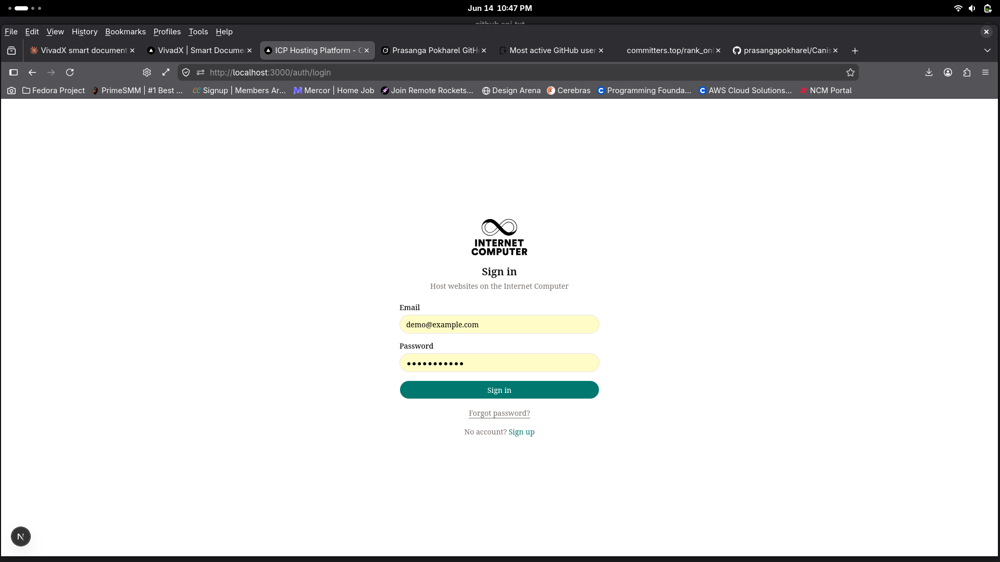
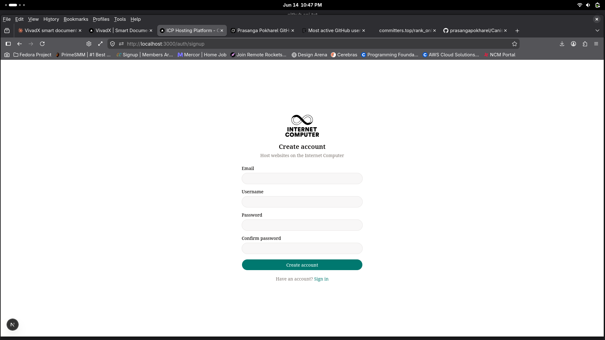
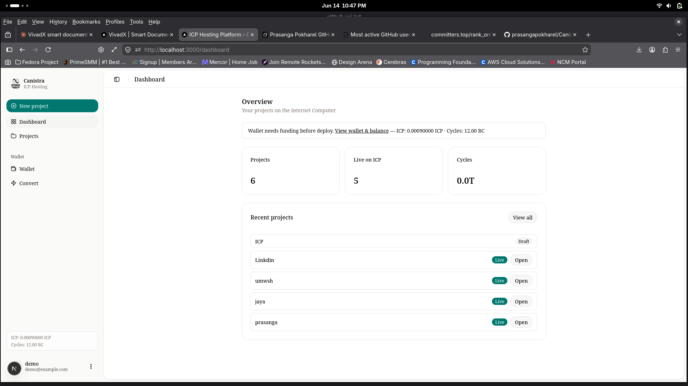
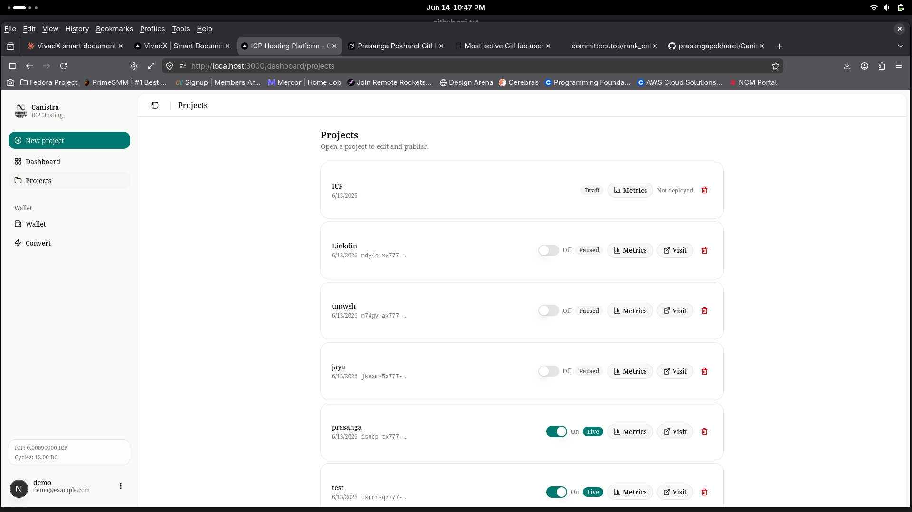
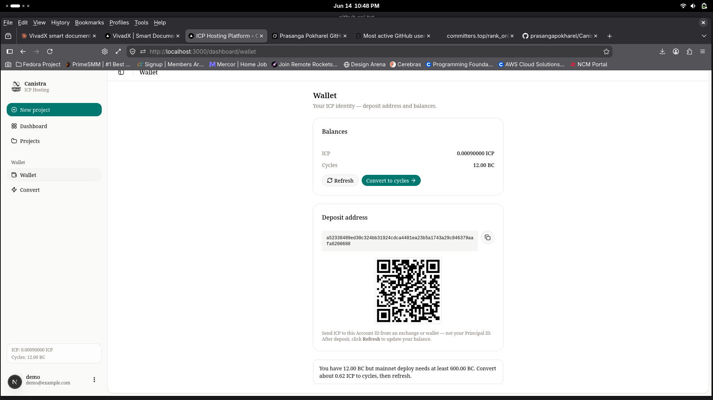
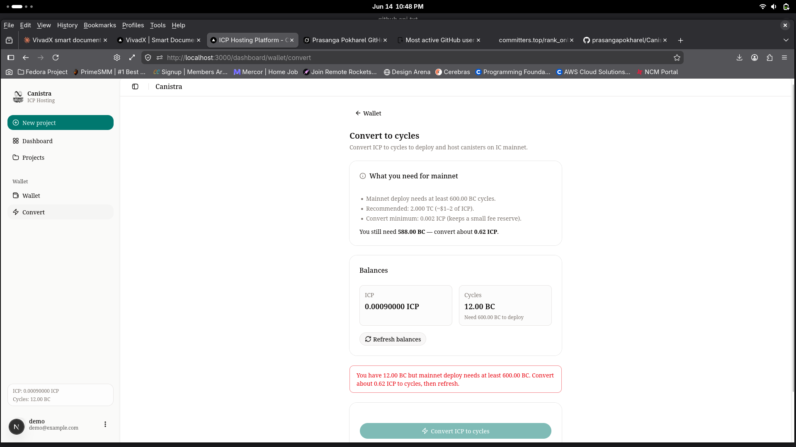
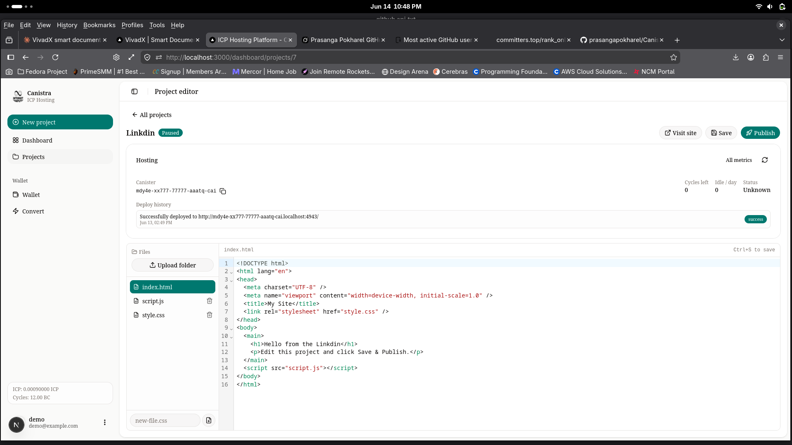

# Canistra ICP Hosting

Host static sites (HTML, CSS, JavaScript) on the **Internet Computer** from a web dashboard. Users sign up, edit projects in the browser, fund a custodial ICP wallet, convert ICP to cycles, and publish to asset canisters on IC mainnet (or a local dfx replica for development).

**Stack:** Next.js frontend · FastAPI backend · PostgreSQL · dfx · Celery/Redis (optional, for background deploys)

---

## How it works

Follow these steps to go from zero to a live site on ICP.

### Step 1 — Install and start the stack

1. Complete [First-time setup](#first-time-setup) below (database, backend, frontend).
2. From the repo root, run:

```bash
chmod +x start.sh
./start.sh
```

3. Open the dashboard at **http://localhost:3000**.

| Service | URL |
|---------|-----|
| Dashboard | http://localhost:3000 |
| API | http://localhost:8000 |
| Swagger docs | http://localhost:8000/docs |

For local canister deploys, use `./start.sh --local-dfx` and set `DEPLOY_NETWORK=local` in `backend/.env`.

### Step 2 — Sign in or create an account

1. Go to **http://localhost:3000/auth/login** to sign in with your email and password.
2. Or open **Sign up** to create a new account (email, username, password).





### Step 3 — Open the dashboard

After login you land on the **Dashboard**. It shows project count, live deployments, cycle balance, and recent projects. Use **New project** to start, or open a project from the list.



### Step 4 — Manage projects

Open **Projects** in the sidebar to see every project. Each card shows status (Draft, Live, Paused), canister ID, and actions: **Visit**, **Metrics**, pause/resume, or delete.



### Step 5 — Fund your wallet

1. Open **Wallet** in the sidebar.
2. Copy your **Deposit address (Account ID)** or scan the QR code.
3. Send ICP from an exchange or wallet (use Account ID, not Principal ID).
4. Click **Refresh** to update your balance.



### Step 6 — Convert ICP to cycles

1. Open **Convert** under Wallet (or **Convert to cycles →**).
2. Check how many cycles you need for mainnet deploy (minimum ~600 BC).
3. Click **Convert ICP to cycles**, then **Refresh balances**.



### Step 7 — Edit and publish to ICP

1. Open a project in the **Project editor**.
2. Edit `index.html`, `style.css`, and `script.js` in the browser (or upload a folder).
3. Click **Save**, then **Publish** to push files to your asset canister.
4. Use **Visit site** to open the live canister URL. Check **Deploy history** for status.



**Production:** set `DEPLOY_NETWORK=ic` and `USE_TESTICP=false` in `backend/.env`, fund with real ICP, convert to cycles, then publish. See [docs/deployment/PRODUCTION_CHECKLIST.md](docs/deployment/PRODUCTION_CHECKLIST.md).

---

## Prerequisites

| Tool | Purpose |
|------|---------|
| **Node.js 20+** | Frontend |
| **Python 3.12+** | Backend |
| **PostgreSQL** | User/project data |
| **dfx** | Deploy & manage canisters |
| **Redis** (optional) | Background deploy queue |

---

## First-time setup

### 1. Database

Create a PostgreSQL database and user (example):

```bash
sudo -u postgres psql -c "CREATE USER icp WITH PASSWORD 'your_password';"
sudo -u postgres psql -c "CREATE DATABASE icp OWNER icp;"
```

### 2. Backend

```bash
cd backend
python3 -m venv .venv
source .venv/bin/activate
pip install -e .

cp .env.example .env
# Edit .env — set DATABASE_URL, JWT_SECRET_KEY, ENCRYPTION_KEY, ADMIN_API_KEY

# Run migrations
alembic upgrade head
```

### 3. Frontend

```bash
cd frontend
npm install
```

### 4. ICP / dfx (optional for local deploys)

```bash
dfx --version   # needs dfx 0.20+
```

For **mainnet** deploys (default in `.env.example`): fund your wallet with real ICP and convert to cycles in the app.

For **local** deploys: set `DEPLOY_NETWORK=local` in `backend/.env` and use `./start.sh --local-dfx`.

---

## Start everything

From the repo root:

```bash
chmod +x start.sh
./start.sh
```

With local dfx replica (local canister deploys):

```bash
./start.sh --local-dfx
```

Press **Ctrl+C** to stop backend and frontend.

> **Tip:** See [How it works](#how-it-works) above for the full wallet → dashboard → publish walkthrough with screenshots.

---

## Start separately

**Backend only**

```bash
cd backend
source .venv/bin/activate
python run.py
```

**Frontend only** (proxies `/api/v1/*` to the backend)

```bash
cd frontend
npm run dev
```

**Production frontend build**

```bash
cd frontend
npm run build
npm start
```

**Celery worker** (optional — async deploys; falls back to sync if Redis is down)

```bash
cd backend
source .venv/bin/activate
celery -A app.tasks.celery_app worker --loglevel=info
```

---

## Environment

Copy `backend/.env.example` → `backend/.env`. Important variables:

| Variable | Description |
|----------|-------------|
| `DATABASE_URL` | PostgreSQL connection string |
| `DEPLOY_NETWORK` | `ic` (mainnet) or `local` (dfx replica) |
| `USE_TESTICP` | `false` for real ICP (production) |
| `JWT_SECRET_KEY` | Auth signing key (32+ chars) |
| `ENCRYPTION_KEY` | Custodial identity encryption (32+ chars) |

See [docs/deployment/PRODUCTION_CHECKLIST.md](docs/deployment/PRODUCTION_CHECKLIST.md) before going live.

---

## Project layout

```
├── frontend/          Next.js dashboard (wallet, projects, editor, deploy)
├── backend/           FastAPI API + dfx integration
├── start.sh           Start backend + frontend together
├── testing/           API scenario checks & unit tests
└── docs/              Organized docs (deployment, architecture, reports, …)
```

---

## Quick test

```bash
cd backend && source .venv/bin/activate
python ../testing/backend_scenario_check.py
```

---

## License

See repository license file if present.
